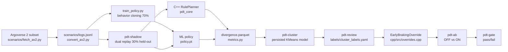
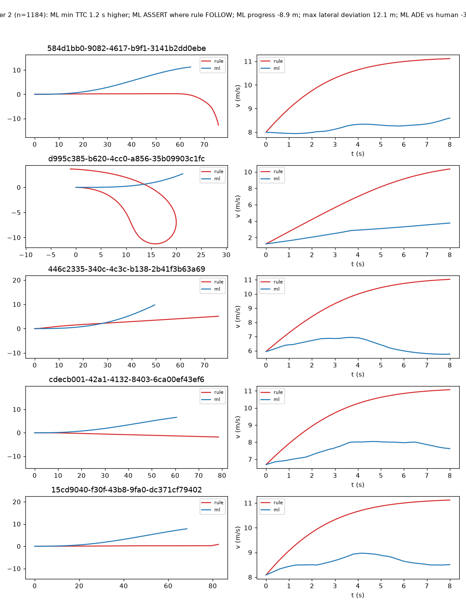
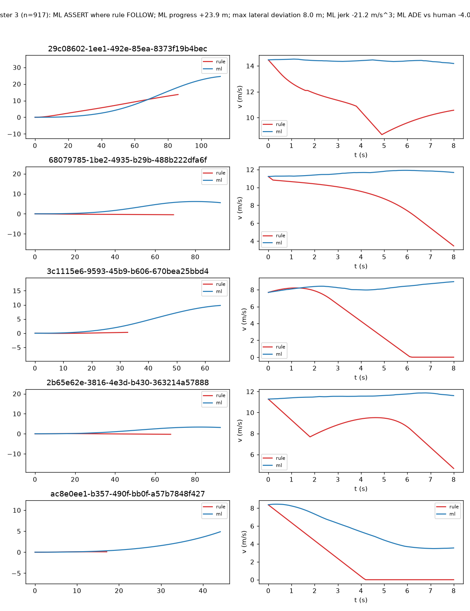
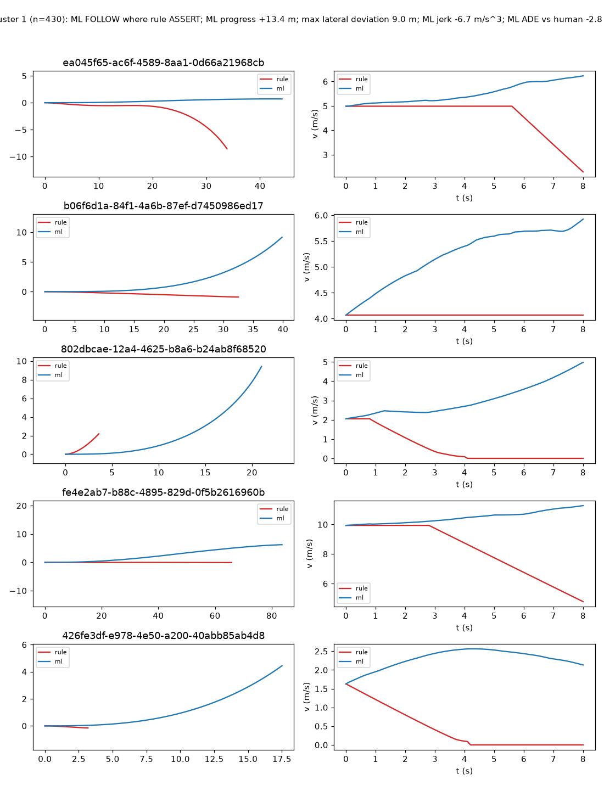

# policy-divergence-triage

**Problem.** A production rule-based planner and a learned ML policy will
disagree, and the disagreements are the point: some of them are the ML policy
being good in ways the planner is not, some are the opposite. This repo replays
real logged driving scenarios (Argoverse 2 Motion Forecasting) through both
systems on identical initial conditions, measures where they diverge, clusters
the divergence signatures, lets a human triage each cluster into
desirable/undesirable/mixed, ports one desirable behavior into the production
C++ planner as a guarded override, and gates the result with an A/B regression
check. Neither system is tuned toward an expected result — whatever the ML
policy does better or worse than the planner is the finding.

## Architecture



1. **Fetch + convert**: a fixed, seeded 10,000-scenario subset of the AV2
   Motion Forecasting VAL split (recorded in `scenarios/manifest.txt`) is
   converted to a JSONL scenario format with ego-frame localization, traversed
   lane centerlines, and documented tag heuristics.
2. **Dual replay**: `pdt-shadow` runs the C++ rule planner and the ML policy on
   identical initial conditions; other agents replay their logged tracks
   (non-reactive) for both systems.
3. **Metrics**: one divergence row per scenario (`divergence.parquet`).
4. **Clustering**: divergence signatures are clustered with a persisted KMeans
   model (silhouette-chosen k); new runs assign to existing clusters.
5. **Triage**: `pdt-review` walks clusters and records human labels.
6. **Port**: the highest-value `desirable` cluster is ported into the C++
   planner as a guarded, toggleable override (two ports so far).
7. **A/B + gate**: `pdt-ab` runs the suite with the override OFF then ON;
   `pdt-gate` blocks the change on any safety regression.

## Repository layout

```
cpp/                 C++17 core: planner, overrides, scenario I/O, pybind11, GoogleTests
python/pdt/          policy.py, train_policy.py, harness.py, metrics.py, cluster.py,
                     review.py, ab.py, gate.py, query.py, geom.py
scenarios/           fetch_av2.py, convert_av2.py, manifest.txt (10,000 committed ids)
tests/               pytest suite + 20-scenario procedural fixture (no AV2 downloads)
labels/              cluster_labels.yaml (human-editable, committed)
gate_config.yaml     regression gate thresholds
scripts/             helper scripts (CI fixture labels)
docs/plots/          committed cluster plots referenced by this README
Makefile             build, test, coverage, pipeline, fixture-pipeline, ...
Dockerfile           multi-stage image; `make pipeline` reproduces all artifacts
docker-compose.yml   4-core pipeline runner with host artifact mounts
.github/workflows/ci.yml  CI on ubuntu-latest
```

## Reproduce

Prerequisites (local): C++17 toolchain, CMake >= 3.20, Python 3.11 with dev
headers, `pip`, `s5cmd` (for the AV2 fetch), network access.

```sh
pip install -e ".[pipeline]" pytest gcovr coverage
make build          # C++ core + pybind module + GoogleTests
make test           # ctest (17 tests) + pytest (29 tests)
make lint           # clang-format + clang-tidy + ruff + mypy
```

The full pipeline from scratch (downloads ~2.4 GB of AV2 data, trains the
policy, replays 2,927 held-out scenarios, clusters, A/Bs, gates):

```sh
make pipeline
```

Docker (4 cores, all artifacts reproduced inside the image):

```sh
docker build -t pdt .
docker run --rm --cpus 4 pdt make pipeline
docker compose up --build   # same, with host artifact mounts
```

The same command measured at the previous 2,000-scenario manifest: **76
minutes end to end** on an Apple Silicon host (native Linux arm64 container, 4
cores; gate passed). The manifest now pins 10,000 scenarios, so the identical
container pipeline is roughly 5x that at the same per-scenario cost. The
pipeline is deterministic within a platform; across platforms the PyTorch side
uses different BLAS backends, so trained-policy numbers can shift slightly and
the target cluster can legitimately differ. Measured per-scenario throughput
(10,000-scenario manifest, 8 workers, Apple Silicon): rule planner **1,870
scenarios/s**, ML policy **4.2 scenarios/s**; the 2,927-scenario held-out
shadow replay completes in **2 min 14 s** wall.

## Real results (held-out 30%, 2,927 scenarios, Argoverse 2 subset)

All numbers below come from committed artifacts
(`artifacts/per_tag_stats.csv`, `artifacts/cluster_summary.json`,
`labels/cluster_labels.yaml`, `artifacts/ab_report.json`).

### Per-tag divergence (mean divergence score)

| tag | n | mean score | max score | avg flips |
|---|---|---|---|---|
| left_turn | 348 | 0.6772 | 0.9687 | 30.6 |
| lane_change | 83 | 0.6643 | 0.8845 | 16.5 |
| right_turn | 325 | 0.6544 | 0.9442 | 17.8 |
| straight_through_intersection | 474 | 0.6415 | 0.9726 | 14.1 |
| lead_vehicle_braking | 961 | 0.6405 | 0.9826 | 15.1 |
| other | 186 | 0.6350 | 0.9419 | 16.1 |
| ped_or_cyclist_interaction | 550 | 0.6306 | 0.9790 | 17.1 |

### Clusters (k = 5 by silhouette, 2,669 rows above the 0.5 score threshold)

| id | size | signature | label |
|---|---|---|---|
| 2 | 1184 | ML min TTC 1.2 s higher; ML ASSERT where rule FOLLOW; ML progress −8.9 m | desirable |
| 3 | 917 | ML ASSERT where rule FOLLOW; ML progress +23.9 m; ML jerk −21.2 | undesirable |
| 1 | 430 | ML FOLLOW where rule ASSERT; ML progress +13.4 m | mixed |
| 0 | 137 | ML ASSERT where rule FOLLOW; max lateral deviation 62.8 m; ML ADE −19.3 m | mixed |
| 4 | 1 | ML min TTC 1251.8 s higher; ML STOP where rule FOLLOW | desirable |

Cluster plots (rule vs ML trajectories for the 5 medoid exemplars; generated by
`pdt-review`):





### Ported overrides: before/after

Target selection (data-driven, see `python/pdt/ab.py`): among
`desirable`-labeled clusters with at least 10 scenarios, the one whose ML
behavior improves safety the most (mean min-TTC delta, tie-broken by size) —
**cluster 2** ("ML brakes earlier and waits; mean min TTC 1.56 -> 2.57 s over
1,184 scenarios"). Two ports, both in `cpp/src/overrides.cpp`, same guard
framework, both toggleable by name (default OFF):

- `EarlyBrakingOverride`: when the nearest forward vehicle within 5 m of the
  path is braking harder than −2.5 m/s^2, or is near-stopped within 10 m,
  brake early (jerk-ramped) to a 4 m stop gap and wait.
- `IntersectionCautionOverride`: when a crossing vehicle conflict would be
  asserted through by the base planner (|t_ego − t_agent| within the 4 s
  extended margin instead of the base 2 s), slow to a stop 5 m before the
  conflict point and wait for it to clear.

Mandatory guards (every override): veto on predicted min TTC < 1.0 s,
predicted jerk > 20 m/s^3, or a pedestrian within 3 m; every activation/veto
is logged with its reason.

Measured on the held-out split (`artifacts/ab_report.json`):

| metric | overrides OFF | overrides ON |
|---|---|---|
| target cluster undesirable rate (fixed population) | 0.246 | **0.214 (−3.2 pp)** |
| target cluster rule collisions | 291 | 236 |
| global collision count | 1,128 | **1,029** |
| hard-brake count | 0 | 0 |
| p95 max jerk (m/s^3) | 34.80 | 34.55 |
| mean min TTC (s) | 1.33 | **1.69** |
| mean progress (m) | 59.63 | 56.68 |

Override activity: `early_braking` 33,935 activations / 630 vetoes (391 jerk,
239 pedestrian buffer); `intersection_caution` 2,878 activations / 19 vetoes
(all pedestrian buffer). No-regression: every non-target cluster's undesirable
rate fell; `pdt-gate` **PASS** (collision count, hard brakes, p95 jerk,
per-cluster rates, no new clusters). The ~3 m mean-progress drop is the
expected cost of the stop-and-wait behaviors. Porting is therefore a
repeatable pattern — two independent clusters, two independent ports, one
shared guard framework and gate.

## How it works

### C++ core (`pdt_core`)

Data model (`cpp/include/pdt/types.hpp`): `State {t,x,y,heading,v,a}`,
`Agent {id, type, track}`, `Scenario {id, tag, ego_init, agents, centerline,
speed_limit, logged_ego}`, `Trajectory {scenario_id, source, states,
decisions}`, `Decision {FOLLOW, YIELD, ASSERT, STOP}`.

**RulePlanner** (`cpp/src/planner.cpp`): deterministic 0.1 s / 8.0 s replay.
Lateral = pure pursuit, lookahead `clamp(1.0·v, 3, 15)` m. Longitudinal = IDM
(headway 1.6 s, min gap 2.0 m, max accel 1.5, comfort decel 2.0 m/s^2, desired
speed = `speed_limit`). Crossing conflicts: constant-velocity agent prediction,
`|t_ego − t_agent| < 2.0 s` yields (stop before the conflict point), else
assert. All thresholds live in `PlannerConfig`.

**Performance** (`cpp/src/spatial.cpp`): a cell-grid spatial index over the
centerline plus an analytic ray-vs-polyline conflict test and exact agent
pruning take the planner from 6.7 to **517 scenarios/s single-threaded** on the
AV2 subset (measured; `pdt-shadow` prints per-system throughput per run).

**Overrides** (`cpp/src/overrides.cpp`): the `Override` interface
(`applicable(scenario, ego, context)` + `apply()` → `PlannerCommand`) with
toggleable-by-name configuration (default OFF), the three non-negotiable
guards, logged events (`RulePlanner.events()`), and a jerk-ramped release
handoff back to the base planner.

### ML policy (`python/pdt/policy.py`)

MLP (256-256) mapping flattened ego state + 6 nearest agents' relative
pose/velocity + 10 centerline points to 40 steps x (accel, steer_rate).
Trained by behavior cloning on the real logged human trajectories (70/30 split
by scenario id; held-out used for all analysis). Closed-loop rollout with a
kinematic bicycle model; decisions derived post-hoc from the speed profile +
leader gap. Inference is deterministic.

### Divergence metrics (`python/pdt/metrics.py`)

One row per scenario. Definitions (full derivation in the module docstring):
lateral deviation = cross-track displacement between the trajectories;
`final_position_gap_m` = endpoint distance; TTC = distance / closing speed vs
every agent, min over steps; jerk = `Δa/Δt`; `decision_flip_count` = steps with
differing decisions; hard brake = any `a < −4.0 m/s^2`; collision = any step
within 2.0 m of an agent; ADE vs the logged human on the aligned 0.1 s grid;
`divergence_score` = weighted tanh-normalized combination (lateral 0.20,
position 0.15, TTC 0.10, jerk 0.10, accel 0.10, decision 0.20, ADE 0.15),
in [0, 1].

### Clustering, triage, A/B, gate

`pdt-cluster` standardizes the numeric metric columns (one-hot flip kind and
tag appended unscaled), sweeps KMeans k = 3..12 by silhouette (DBSCAN eps sweep
reported), and persists scaler + model so new runs assign to existing clusters.
`pdt-review` walks clusters, prints signatures and ASCII rule-vs-ML plots per
exemplar, prompts for labels, and exports PNGs. `pdt-ab` runs the held-out
suite with the override OFF then ON and emits `ab_report.md/json`.
`pdt-gate` fails on any safety regression per `gate_config.yaml`.

## Testing and coverage

- GoogleTest (17 tests): planner determinism (byte-identical replans), IDM
  bounds/convergence, yield stop-before-conflict and assert/resume behavior,
  pure-pursuit convergence, scenario JSONL round-trip and error handling,
  override guards (TTC-floor applicability, pedestrian veto, byte-identical
  OFF trajectory, safe-gap stop).
- pytest (29 tests): metric definitions (hand-computed TTC, zero-divergence
  score, order independence), clustering (seed reproducibility, persisted-model
  assignment without refit), review label round-trip and plots, A/B report
  building, gate pass/fail, CLI plumbing, and one end-to-end test running the
  20-scenario fixture through the whole pipeline asserting the gate passes.
- Measured coverage (`make coverage`): **C++ 93%** line coverage
  (gcovr over `cpp/src` + `cpp/include`), **Python 77%** statement coverage
  (coverage.py over `python/pdt`).

## Limitations (honest)

- **Non-reactive agents**: both systems replay other agents' logged tracks;
  nothing reacts to the ego. Divergences come from the policies, not from
  differing agent behavior — but also no interaction effects are modeled.
- **Constant-velocity prediction**: the planner's yield logic predicts agents
  at constant velocity over the horizon (the override guards use a short,
  constant-acceleration window instead). Agents that accelerate into a
  crossing can defeat the yield margin.
- **Default speed limits**: AV2 maps carry no posted limits; we use documented
  per-lane-type defaults (VEHICLE/BUS 11.18 m/s, BIKE 6.71 m/s).
- **10,000-scenario subset**: a fixed, seeded subset of the VAL split (the
  committed `scenarios/manifest.txt`), not the full dataset.
- **Covariate shift**: the ML policy is cloned from human open-loop behavior
  and evaluated closed-loop; its input distribution drifts from training. It
  also relies on the same imperfect stitched centerlines as the planner.
- **Map-dependent collisions**: some rule-planner collisions stem from the
  stitched centerline diverging from the real road (obstacles > 5 m off the
  planned path); no rule on the planner's world model can fix those, and the
  override does not attempt to.

## License and attribution

The Argoverse 2 Motion Forecasting Dataset is licensed CC BY-NC-SA 4.0
(non-commercial). See `NOTICE` for the required attribution. Dataset files are
never stored in this repository.
